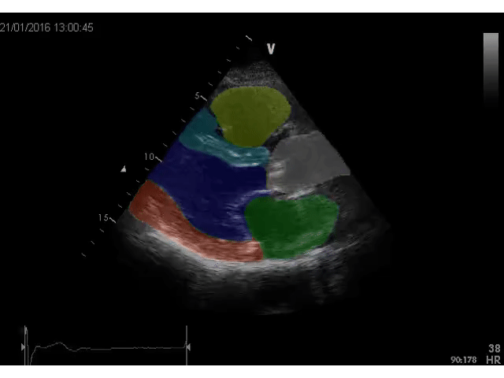

# Echo PLAX Segmentation

A deep neural network based approach to segment medical echocardiography PLAX images into 6 main heart structures.

## Introduction

Echocardiography images (echo) are ultrasound scans of the heart. Here, a deep full convolutional neural network (FCN) that has its architecture inspired by U-Net is trained to segment the echos. Also, here only the PLAX view is considered, go to https://github.com/raventan95/echo-view-classifier to know more about different echo views. In this particular view, 6 main heart structures can be visible, namely left ventricle, right ventricle, left atrium, aorta, septum and outer cardiac wall. This kind of segmentation can be useful in several ways, for instance, helping medical students to understand a segmented/labelled echo, or assisting doctors in measuring dimensions of heart structures automatically.

The neural network is built using TensorFlow Keras library, with a U-Net FCN architecture. The output is passed through a softmax layer to predict 1 out of 7 views (6 heart structures + background). It has managed to achieve an intersection-over-union (IOU) accuracy of 89.3% on average (71 test images).

## Dependencies

This Python file is tested on
- Python 3.6
- NumPy 1.15
- Keras 2.2.4
- ImageIO 2.4
- MatPlotLib 3.0
- SciKit-Image 0.14

## How to run

1. `Pull` or download repository to your local directory.
2. Download trained model weight from this [Dropbox](https://www.dropbox.com/s/uh1oon0376klmi0/mymodel_segmentation_1_0.8930.h5?dl=0) to the folder `model/` in the local directory.
3. There are already sample videos provided in `sample/`. Feel free to add your own echo videos to evaluate the model. Note: currently only support mp4 format.
4. Run the Python script
```
python segment.py
```
5. Segmented videos are saved in `result/` folder.

## Sample results

Here are two examples of segmented video from the model, evaluated on the provided sample videos. 

- yellow : right ventricle
- light blue : septum
- dark blue : left ventricle
- gray : aorta
- green : left atrium
- orange : outer cardiac wall

|  |   |
|:--:|:--:|
| Sample2 segmented | Sample4 segmented |
